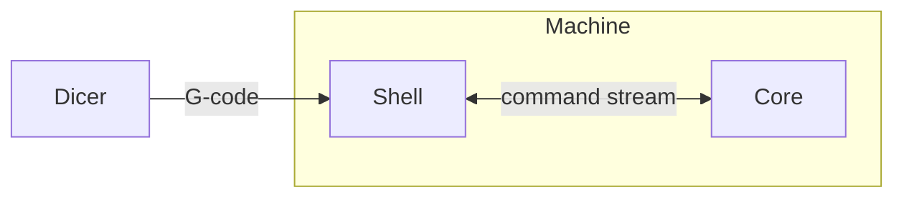
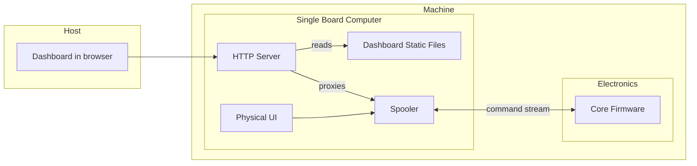
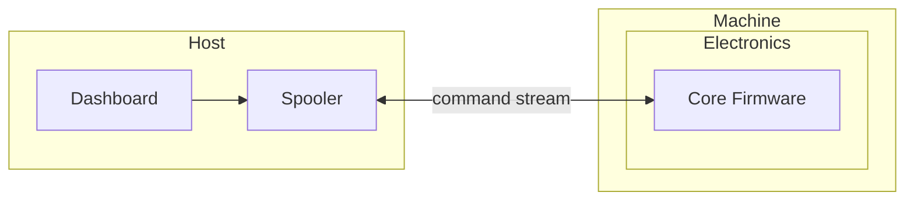

From the user's point of view, Spark stack looks like this:

* Dicer is a GUI that user puts 3D file & configs, and emits G-code
* Machine receives G-code via Shell, and carves out 3D physical object
  * Core is the firmware that abstracts hardware as [a serial protocol](https://github.com/xy-kasumi/Spark-corefw/blob/main/spec/protocol.md)

Machine's UI can vary:
* it can be hardware display, knobs etc
* it can be web UI

## Why not X?

### Why not Klipper?
In Klipper, Linux board runs Python to generate low-level (individual motor steps) with timestamps, and stream them to firmwares.
* Firmwares buffers low-level commands and executes them based on timestamps.

Issues
* Low-level timestamped commands (core design chocie in Klipper) will not work in EDM
  * EDM control loop needs fast (probably 100Hz+) realtime control based on sensing.
  * Python + Linux is not well-suited to handle such low-latency computation reliably for hours.
  * Monotonic timestamp is also very-baked in idea, canceling and re-ordering of commands look hard.

Good things
* Separation of UI & control

### Why not grblHAL?
grblHAL is a pretty flexible firmware for generic CNC machine.
It also provides HAL (hardware abstraction layer) for electronics, plugin-based flexible architecture.

Issues
* Too hard to change behavior of G1 for EDM-control loop
  * Lots of non-plugin exposed behavior (need to modify core code)
  * G-code & motion planning ring buffers is too baked in for a change to backtrackable data structure
* Sender GUIs assumes too much machine knoweldge from users
  * We won't be using them anyway

### Why not Marlin?
Marlin is basically everything-in-single-firmware design.

Issues
* Since machine geometry & UI will be quite different, very little can be reused from Marlin firmware.
  * Rewrite would be easier.

## Spark Architecture
Assumption is that:
* Core is very minimum; zero user I/O, no SD-card. Only command stream over UART.
* Linux single board computer (e.g. Raspberry Pi) handles every UI

Spooler provides non-realtime machine interface by:
* keep G-code file cache locally
* streams G-code reliably & monitors Core even when network is offline or dashboard is gone

The command stream is high-level (G-code + system commands).
Core buffers hopefully more than 1 second of G-code,
to prevent occasional hiccups in Linux from causing troubles.

Final setup of Split Shell

By having "Physical UI" program which interfaces with buttons, displays, speakers etc,
it's very easy to have on-device rich UI if wanted.

Split shell configuration allows same dashboard & spooler to be used in host environment,
offering rich & flexible dashboard while developing hardware & electronics.

